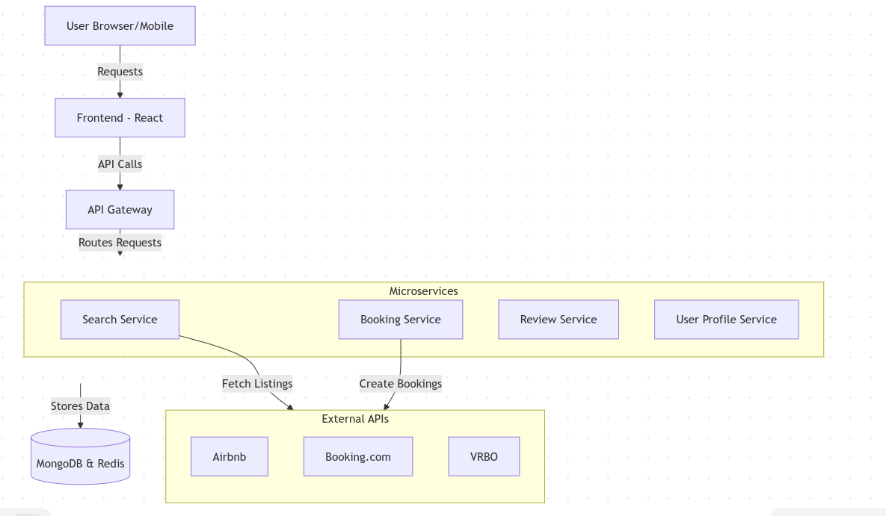

# StayEasy

## Hotel Booking Made Simple

StayEasy is a modern hotel booking platform that connects travelers with hotels for a smoother travel experience. Our platform provides effortless booking for guests and efficient management tools for hotel owners, creating a seamless experience for all parties involved.

[Project Blog](https://medium.com/@clintonnyakoe/stayeasy-building-a-modern-hotel-booking-platform-4e8f7d9a2b85) |
[Author's LinkedIn](https://www.linkedin.com/in/clinton-nyakoe-00953b270/)



## Introduction

StayEasy addresses the common frustrations in hotel booking by providing:

- A user-friendly interface for travelers to find and book accommodations
- Powerful management tools for hotel owners to showcase properties and manage bookings
- Streamlined communication between travelers and hoteliers

The platform aims to simplify the hotel booking process while providing comprehensive information for travelers to make informed decisions.

## Features

- **For Travelers**:

  - Advanced search and filtering options
  - Detailed hotel information and high-quality images
  - Secure booking and payment processing
  - User reviews and ratings
  - Booking management dashboard

- **For Hotel Owners**:
  - Property listing and management tools
  - Booking administration system
  - Guest communication platform
  - Analytics and performance metrics

## Technologies Used

### Frontend

- **Languages**: JavaScript, HTML, CSS
- **Framework**: React with TypeScript
- **Styling**: Tailwind CSS
- **Libraries**: Bootstrap, Moment.js, jQuery

### Backend

- **Languages**: JavaScript
- **Framework**: Express.js (Node.js)
- **Database**: MongoDB with Mongoose
- **Payment Processing**: Stripe

### Deployment

- **Platform**: Render (PaaS)

## Installation

To set up the project locally, follow these steps:

```bash
# Clone the repository
git clone https://github.com/Clinton431/mern-booking-app
cd stayeasy

# Install backend dependencies
npm install

# Install frontend dependencies
cd client
npm install
cd ..

# Set up environment variables
cp .env.example .env
# Edit .env file with your configuration

# Run the development server
npm run dev
```

## Usage

After installation, you can:

1. Create an account as a traveler or hotel owner
2. Browse hotels or list your property
3. Make bookings or manage reservations
4. Explore the various features designed for your user type

### For Travelers


1. Search for hotels based on location, dates, and amenities
2. View detailed information about each property
3. Make secure bookings with our payment system
4. Manage your reservations and communicate with hotel staff

### For Hotel Owners


1. Create and manage your property listings
2. View and respond to booking requests
3. Track occupancy and revenue metrics
4. Communicate with guests directly

## Project Structure

```
stayeasy/
├── client/                  # Frontend React application
│   ├── public/              # Public assets
│   └── src/                 # Source files
│       ├── components/      # React components
│       ├── pages/           # Page components
│       ├── services/        # API services
│       └── utils/           # Utility functions
├── server/                  # Backend Express application
│   ├── controllers/         # Request controllers
│   ├── models/              # Database models
│   ├── routes/              # API routes
│   └── utils/               # Utility functions
├── config/                  # Configuration files
└── tests/                   # Test suites
```

## Development Roadmap

- [x] MVP Release
- [x] Basic booking functionality
- [x] Hotel management dashboard
- [ ] Mobile application
- [ ] Enhanced analytics for hotel owners
- [ ] Loyalty program for travelers
- [ ] Integration with third-party travel services

## Contributing

We welcome contributions to StayEasy! To contribute:

1. Fork the repository
2. Create a feature branch (`git checkout -b feature/amazing-feature`)
3. Commit your changes (`git commit -m 'Add some amazing feature'`)
4. Push to the branch (`git push origin feature/amazing-feature`)
5. Open a Pull Request

Please read our [Contributing Guidelines](CONTRIBUTING.md) for more details.

## Related Projects

- [Booking.com](https://www.booking.com/) - Another hotel booking platform with different focus
- [TravelBuddy](https://github.com/example/travelbuddy) - Travel planning application with hotel booking capabilities
- [BookMyStay](https://github.com/example/bookmystay) - Simple hotel reservation system

## License

This project is licensed under the MIT License - see the [LICENSE](LICENSE) file for details.

## Acknowledgments

- Clinton Nyakoe's "Eloquent JavaScript" for core concepts and research.
- The React and Node.js communities for excellent documentation
- Steve Krug's "Don't Make Me Think" for UX inspiration

## Contact

Clinton Nyakoe - [@clintonnyakoe](https://x.com/ClintonNyakoe)

Project Link: [https://mern-booking-app-xj3g.onrender.com/](https://github.com/Clinton431/mern-booking-app)
